# Noire [](https://godoc.org/github.com/teacat/noire) [](https://coveralls.io/github/teacat/noire?branch=master) [](https://travis-ci.org/teacat/noire) [](https://goreportcard.com/report/github.com/teacat/noire)

支援 RGB、HSL、HSV、CMYK、Hex、HTML 顏色代碼進行轉換與顏色（亮度、飽和度…等）編輯的套件。

## 效能比較

```
測試規格：
4.2 GHz Intel Core i7 (8750H)
32 GB 2666 MHz DDR4

goos: windows
goarch: amd64
pkg: github.com/teacat/noire
BenchmarkCMYKToRGB-12         	100000000	        22.5 ns/op	       0 B/op	       0 allocs/op
BenchmarkRGBToCMYK-12         	50000000	        26.9 ns/op	       0 B/op	       0 allocs/op
BenchmarkRGBToHSL-12          	50000000	        26.6 ns/op	       0 B/op	       0 allocs/op
BenchmarkHSLToRGB-12          	100000000	        17.2 ns/op	       0 B/op	       0 allocs/op
BenchmarkHSVToRGB-12          	100000000	        15.3 ns/op	       0 B/op	       0 allocs/op
BenchmarkRGBToHSV-12          	50000000	        29.3 ns/op	       0 B/op	       0 allocs/op
BenchmarkRGBToHex-12          	20000000	        85.4 ns/op	      32 B/op	       4 allocs/op
BenchmarkHexToRGB-12          	50000000	        36.1 ns/op	       8 B/op	       1 allocs/op
BenchmarkHTMLToRGBName-12     	20000000	       118 ns/op	      40 B/op	       3 allocs/op
BenchmarkHTMLToRGBHex-12      	30000000	        41.0 ns/op	       8 B/op	       1 allocs/op
BenchmarkRGBToHTML-12         	20000000	       103 ns/op	      32 B/op	       4 allocs/op
BenchmarkMix-12               	 5000000	       292 ns/op	     112 B/op	       5 allocs/op
BenchmarkHue-12               	50000000	        33.5 ns/op	       0 B/op	       0 allocs/op
BenchmarkSaturation-12        	50000000	        33.7 ns/op	       0 B/op	       0 allocs/op
BenchmarkLightness-12         	50000000	        33.7 ns/op	       0 B/op	       0 allocs/op
BenchmarkAdjustHue-12         	20000000	        79.0 ns/op	      32 B/op	       1 allocs/op
BenchmarkLighten-12           	20000000	        78.2 ns/op	      32 B/op	       1 allocs/op
BenchmarkDarken-12            	20000000	        77.8 ns/op	      32 B/op	       1 allocs/op
BenchmarkSaturate-12          	20000000	        74.1 ns/op	      32 B/op	       1 allocs/op
BenchmarkDesaturate-12        	20000000	        79.0 ns/op	      32 B/op	       1 allocs/op
BenchmarkGrayscale-12         	20000000	        71.8 ns/op	      32 B/op	       1 allocs/op
BenchmarkComplement-12        	20000000	        79.9 ns/op	      32 B/op	       1 allocs/op
BenchmarkTint-12              	30000000	        40.8 ns/op	      32 B/op	       1 allocs/op
BenchmarkShade-12             	30000000	        40.9 ns/op	      32 B/op	       1 allocs/op
BenchmarkInvert-12            	50000000	        24.9 ns/op	      32 B/op	       1 allocs/op
BenchmarkLuminanaceWCAG-12    	10000000	       224 ns/op	       0 B/op	       0 allocs/op
BenchmarkLuminanace-12        	300000000	         6.00 ns/op	       0 B/op	       0 allocs/op
BenchmarkContrast-12          	 5000000	       257 ns/op	       0 B/op	       0 allocs/op
BenchmarkIsLight-12           	2000000000	         0.26 ns/op	       0 B/op	       0 allocs/op
BenchmarkIsDark-12            	2000000000	         0.26 ns/op	       0 B/op	       0 allocs/op
BenchmarkHSV-12               	50000000	        34.2 ns/op	       0 B/op	       0 allocs/op
BenchmarkHSVA-12              	50000000	        35.0 ns/op	       0 B/op	       0 allocs/op
BenchmarkHSL-12               	50000000	        31.9 ns/op	       0 B/op	       0 allocs/op
BenchmarkHSLA-12              	50000000	        32.0 ns/op	       0 B/op	       0 allocs/op
BenchmarkRGB-12               	2000000000	         0.52 ns/op	       0 B/op	       0 allocs/op
BenchmarkRGBA-12              	2000000000	         0.26 ns/op	       0 B/op	       0 allocs/op
BenchmarkCMYK-12              	50000000	        32.9 ns/op	       0 B/op	       0 allocs/op
BenchmarkHex-12               	20000000	        90.1 ns/op	      32 B/op	       4 allocs/op
BenchmarkHTMLHex-12           	10000000	       146 ns/op	      40 B/op	       5 allocs/op
BenchmarkHTMLName-12          	20000000	       107 ns/op	      32 B/op	       4 allocs/op
BenchmarkHTMLRGBA-12          	 2000000	       839 ns/op	      96 B/op	       5 allocs/op
PASS
ok  	github.com/teacat/noire	67.640s
Success: Benchmarks passed.
```

## 安裝方式

打開終端機並且透過 `go get` 安裝此套件即可。

```bash
$ go get github.com/teacat/noire
```

## 使用方式

透過 `noire.NewRGB`（或是 `NewHex`…等）來初始化一個顏色並且開始編輯。

```go
package main

import (
	"fmt"

	"github.com/teacat/noire"
)

func main() {
	c := noire.NewRGB(255, 255, 255)
	fmt.Println(c.Invert().Hex())       // 輸出：000000
}
```

## 支援色彩演算法

Noire 能夠將下列顏色互相轉換。

* RGB
* CMYK
* HSL
* HSV
* Hex
* HTML

## 函式說明

這裡有些函式無法透過圖表說明他們的用途。

* `Hue`：取得基於 HSL 演算法的色相角度值。
* `Saturation`：會取得基於 HSL 演算法的飽和百分比。
* `Lightness`：取得基於 HSL 演算法的明亮百分比。
* `LuminanaceWCAG`：取得目前顏色基於 WCAG 2.0 演算法的流明度。
* `Luminanace`：取得目前顏色的流明度。
* `Contrast`：透過 WCAG 流明度演算法算出與指定顏色的對比度。
* `IsLight`：得知顏色是否為亮色，但有些時候這可能與肉眼所見的不相符。
* `IsDark`：得知顏色是否為暗色，但有些時候這可能與肉眼所見的不相符。

### 加亮（Lighten）

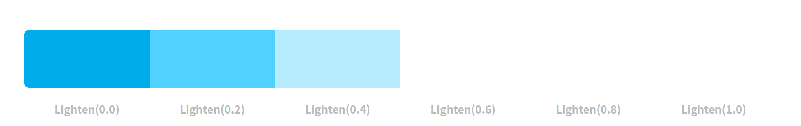

以 HSL 的模式提高顏色的亮度，但這有可能會過於明亮。

### 明亮（Brighten）

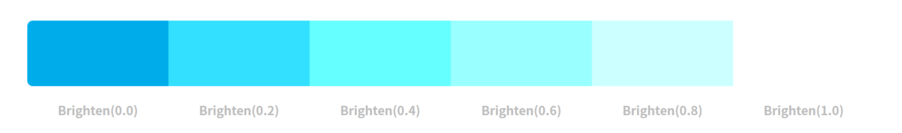

以 RGB 的模式提高顏色的亮度。

### 混和加亮（Tint）

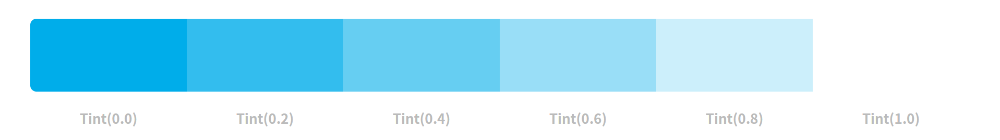

將目前顏色混上白色以達到最佳平衡與飽和來提高顏色亮度。

### 調暗（Darken）

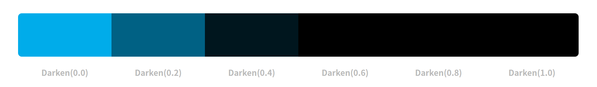

以 HSL 的模式降低顏色的亮度，但這有可能會過於暗沉。

### 混和調暗（Shade）


將目前顏色混上黑色以達到最佳平衡與飽和來降低顏色亮度。

### 提高飽和度（Saturate）

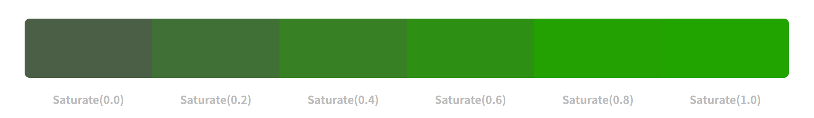

以 HSL 的模式提高顏色的飽和度。

### 降低飽和度（Desaturate）

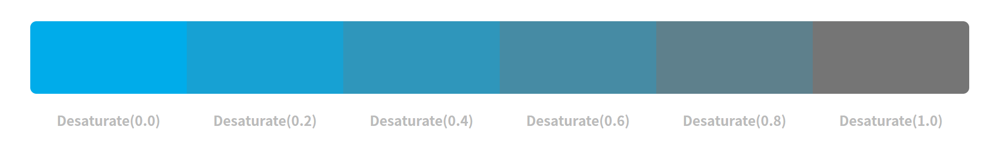

以 HSL 的模式降低顏色的飽和度。

### 更改色相角度（AdjustHue）

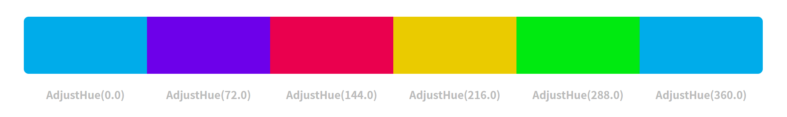

以 HSL 的模式旋轉色相角度，當超過 360 度時會繼續以順時針旋轉。

### 混合（Mix）

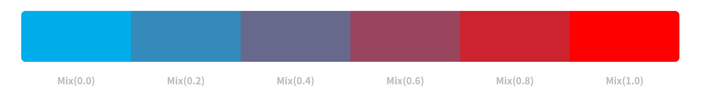

將顏色與另一個顏色混合，並且自訂第二顏色的混色權重。

### 反相色（Invert）

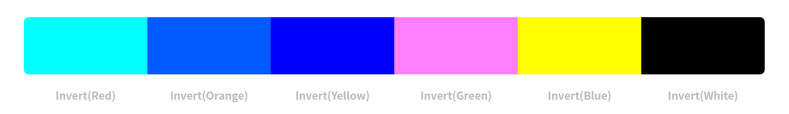

取得 RGB 顏色在絕對座標上的相反位置，並將整個顏色反轉（不是互補色但趨近於）。

### 互補色（Complement）

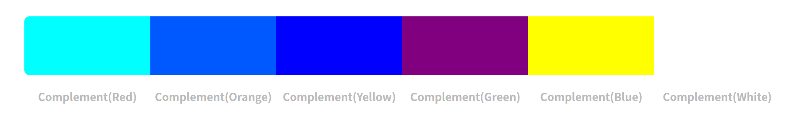

取得顏色的互補色（色相環的對面色），相當於 `AdjustHue(180)`。

### 灰階（Grayscale）

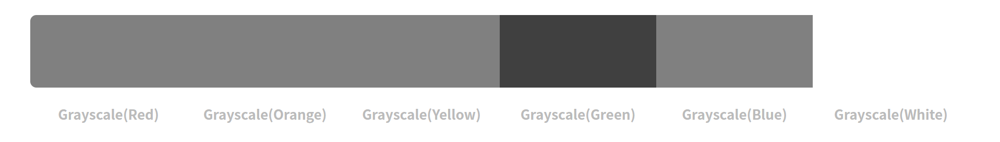

將顏色轉換成灰階色調，相當於 `Desaturate(1)`。

### 前景色（Foreground）

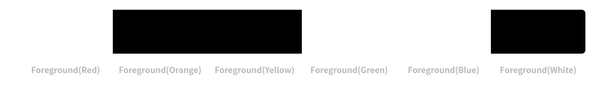

取得基於目前顏色流明度而推薦的前景文字顏色（黑或白），越暗的背景就會採用白色文字，反之亦然。

## 可參考文件

[RGB 轉 HSV, HSL (線上色碼轉換 HSL, HSV, RGB, HEX)](https://www.ginifab.com.tw/tools/colors/rgb_to_hsv_hsl.html)

[ozdemirburak/iris: PHP library for color manipulation and conversion.](https://github.com/ozdemirburak/iris)

[G17: Ensuring that a contrast ratio of at least 7:1 exists between text (and images of text) and background behind the text | Techniques for WCAG 2.0](https://www.w3.org/TR/WCAG20-TECHS/G17.html#G17-tests)

[Using Sass to automatically pick text colors](https://medium.com/dev-channel/using-sass-to-automatically-pick-text-colors-4ba7645d2796)

[Relative luminance - Wikipedia](https://en.wikipedia.org/wiki/Relative_luminance)

[user interface - Given a background color, how to get a foreground color that makes it readable on that background color? - Stack Overflow](https://stackoverflow.com/questions/3116260/given-a-background-color-how-to-get-a-foreground-color-that-makes-it-readable-o)

[image - Formula to determine brightness of RGB color - Stack Overflow](https://stackoverflow.com/questions/596216/formula-to-determine-brightness-of-rgb-color)

[Ant Design 色板生成算法演进之路 - 知乎](https://zhuanlan.zhihu.com/p/32422584)

[Sass基础——颜色函数_Preprocessor, Sass, SCSS 教程_w3cplus](https://www.w3cplus.com/preprocessor/sass-color-function.html)